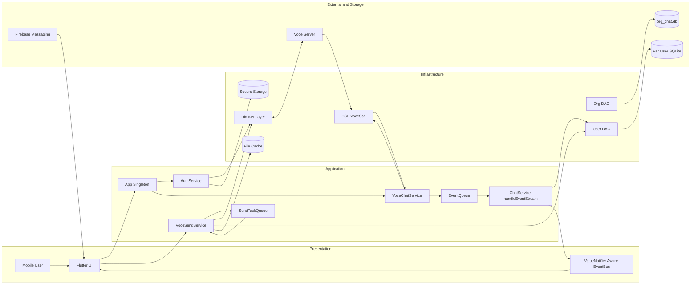
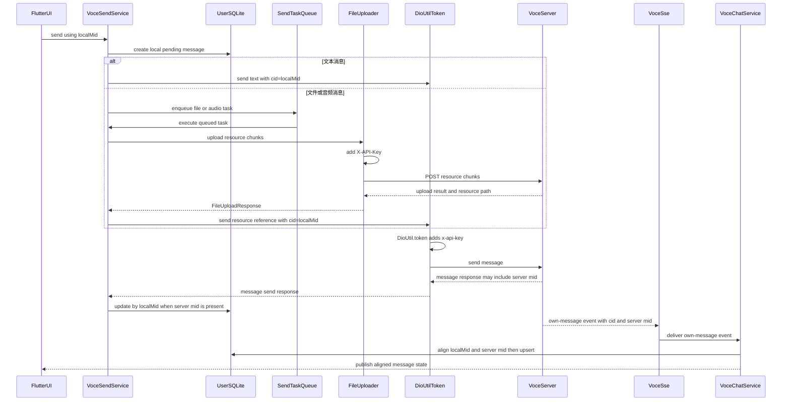

# VoceChat Client 项目报告
> 审计日期：2026-07-10
>
> 审计基线：`e38c2e2ca50667af0e204f4745022097ee746ac1`
>
> 原始分支：`master`
>
> 应用版本：`0.2.113+83`
>
> 【运行验证】Origin：`https://github.com/dc-daichao95/vocechat-client-uu.git`
>
> 【运行验证】Upstream：未配置
>
> 报告范围：Android / iOS Flutter 客户端
>
> 【用户决策】本仓库按独立 fork 的治理边界维护，不把该判断表述为 Git 可证明的事实。
>
> 路径说明：本文所有源码路径与 `path:line` 证据均相对仓库根目录；“关键文件索引”的 Markdown 链接以 `docs/` 为起点。
## 目录
- [1. 执行摘要与结论](#1-执行摘要与结论) · [2. 项目定位、范围与功能地图](#2-项目定位范围与功能地图)
- [3. 仓库结构与模块职责](#3-仓库结构与模块职责) · [4. 当前架构](#4-当前架构)
- [5. 核心链路](#5-核心链路) · [6. 工程、构建、i18n、发布现状](#6-工程构建i18n发布现状)
- [7. 测试与质量](#7-测试与质量) · [8. 安全与供应链风险](#8-安全与供应链风险)
- [9. 实际验证结果](#9-实际验证结果) · [10. 技术债与维护风险](#10-技术债与维护风险)
- [11. 目标架构和渐进 Riverpod 路线](#11-目标架构和渐进-riverpod-路线) · [12. P0/P1/P2 路线图](#12-p0p1p2-路线图)
- [13. 后续开发约束、待确认项、关键文件索引](#13-后续开发约束待确认项关键文件索引)
## 1. 执行摘要与结论
### 1.1 总体判断
- 【历史事实】审计基线 commit `e38c2e2` 中的 README 原 1-9 行把项目描述为 VoceChat 自托管服务端的纯前端客户端，并附带账户数据删除说明；该证据仅描述基线历史，不是对当前 README 内容或行号的引用。
- 【事实】当前版本为 `0.2.113+83`，Dart SDK 约束为 `>=2.17.0 <3.0.0`（`pubspec.yaml:19-22`）。
- 【推断】该 Dart 约束会限制采用 Dart 3 及依赖它的新版本 package，后续升级需要先建立兼容性基线（`pubspec.yaml:19-22`）。
- 【事实】项目描述明确面向 iOS 与 Android；Firebase 平台分支也只为 Android、iOS 提供配置，其他平台直接抛出 UnsupportedError（`pubspec.yaml:1-2`，`lib/firebase_options.dart:17-49`）。
- 【运行验证】Git remote 检查确认 origin 为上述 URL，且未配置名为 upstream 的 remote。
- 【事实】核心运行状态机制包括全局单例、手写 Aware listener、EventBus、ValueNotifier 与 SQLite DAO（`lib/app.dart:18-39`，`lib/globals.dart:10-24`，`lib/services/voce_chat_service.dart:48-98`，`lib/dao/dao.dart:64-100`）。
- 【事实】`provider` package 已声明，但静态检索未发现其运行时代码使用；Riverpod 未安装，当前运行架构不能描述为 Provider 或 Riverpod 架构（`pubspec.yaml:89-93`）。
- 【事实】持久连接当前强制使用 SSE，WebSocket 探测与切换逻辑已被注释；历史变更记录也说明 WebSocket 曾因连接不稳定被暂时禁用（`lib/services/voce_chat_service.dart:122-130`，`assets/changelog.json:14-18`）。
- 【事实】静态代码中存在无条件接受服务端证书的 Dio adapter 实现（`lib/api/lib/dio_util.dart:54-71`）。
- 【推断】该实现覆盖认证、消息与上传相关网络面的潜在影响较大，因此列为 Critical 风险；本次未动态确认它在实际产物中生效。
- 【事实】Android 静态配置允许 cleartext、信任 user CA，iOS 静态配置允许 ArbitraryLoads；Android Manifest 第 39 行属性位置不正确（`android/app/src/main/AndroidManifest.xml:32-40`，`android/app/src/main/res/xml/network_security_config.xml:1-9`，`ios/Runner/Info.plist:52-56`）。
- 【事实】现有测试目录只有 3 个空桩，没有可证明业务正确性的自动化测试（`test/widget_test.dart:18-22`，`test/api_test.dart:1-5`，`test/db_test.dart:1`）。
- 【运行验证】当前 PowerShell 会话无法从 PATH 解析 `flutter`、独立 `dart` 与 `java`；相关工具命令未启动，构建、分析、测试、格式和代码生成检查均为 BLOCKED。
- 【用户决策】交付顺序固定为“稳定安全 → 渐进升级 → 功能”。
- 【用户决策】当前只允许 P0 稳定安全工作实施和准备 PR；P0 从首个子阶段 P0.0“首次可观测基线”开始。P1 仅可调研、设计与兼容性 spike，不得进入生产代码或形成可合并升级 PR，P0 验收完成后才允许实施；P2 功能仅可调研、设计，P0、P1 均验收完成后才允许实施 feature PR。
- 【用户决策】默认启用严格 TLS 并使用系统信任根；自签证书仅允许显式、受控、可撤销、可审计的 per-server opt-in，禁止静默 TOFU，pin mismatch 必须 fail closed。
- 【用户决策】保持行为兼容，在拆分边界的同时用 Riverpod 渐进统一新的有界状态，禁止一次性重写。
### 1.2 建议结论
- 【推断】P0 先执行首个子阶段 P0.0，恢复并记录首次可观测构建基线；随后在 P0.1 完成依赖锁定、收紧 TLS 与平台网络策略、移除原始密码持久化并建立 CI（`lib/api/lib/dio_util.dart:54-71`，`lib/services/auth_service.dart:245-264`，`.gitignore:43-47`，`test/widget_test.dart:18-22`）。
- 【推断】P0 验收完成后，P1 才实施 Flutter / Dart 分阶段升级、数据层与连接层解耦（`pubspec.yaml:19-22`，`lib/services/db.dart:63-180`）。
- 【推断】P0、P1 均验收完成后，P2 才实施功能开发、体验优化与 Agora 等能力评估。
- 【推断】安全默认值、工具链可复现性和回归保护不足，不适合在没有门禁的情况下快速叠加功能（`lib/api/lib/dio_util.dart:54-71`，`.gitignore:43-47`，`test/widget_test.dart:18-22`）。
- 【推断】稳妥的演进方式是保留现有 API、SQLite schema 和 UI 行为，以 adapter / repository / controller 边界逐块替换全局状态（`lib/app.dart:18-45`，`lib/services/db.dart:63-180`）。
## 2. 项目定位、范围与功能地图
### 2.1 产品定位
- 【历史事实】审计基线 commit `e38c2e2` 中的 README 原 1-9 行把项目定位为自托管 Voce server 的客户端；当前源码与包描述仍表明这是 Flutter 移动客户端（`pubspec.yaml:1-2`）。
- 【事实】客户端覆盖认证、账号切换、聊天同步、发送与本地持久化（`lib/services/auth_service.dart:170-326`，`lib/app.dart:45-115`，`lib/services/voce_chat_service.dart:122-158`，`lib/services/voce_send_service.dart:39-130`）。
- 【推断】本地 SQLite 是同步缓存与离线状态载体，不应被视为服务端权威数据源（`lib/services/voce_chat_service.dart:403-530`，`lib/services/db.dart:146-180`）。
- 【历史事实】审计基线 commit `e38c2e2` 中的 README 原 1-9 行仅提供产品短述和通过 Web 前端或服务端 SQLite 删除数据的两种方式，当时未提供开发、构建、测试、签名和发布流程；这不是当前 README 的缺失结论。
- 【当前文档事实】当前 README 已重写为项目与开发入口，覆盖状态、预期开发命令、平台构建、风险边界和安全删除提示（`README.md:1-177`）。
### 2.2 支持范围
- 【事实】支持 Android 与 iOS（`pubspec.yaml:1-2`）。
- 【事实】界面本地化当前声明英语和中文两种 Locale（`lib/main.dart:266-276`）。
- 【事实】应用启动时初始化 Firebase Messaging，并请求通知权限（`lib/main.dart:89-115`）。
- 【事实】支持 Universal Link / Deep Link，并把解析交给 SharedFuncs（`lib/main.dart:356-371`）。
- 【事实】报告不把 Web、Windows、Linux 或 macOS 视为受支持目标；这些平台在 FirebaseOptions 中明确进入 UnsupportedError 分支（`lib/firebase_options.dart:17-49`）。
### 2.3 功能地图
- 【事实】账户：密码登录、记住密码、token 刷新、登出与自删除（`lib/services/auth_service.dart:92-105`，`lib/services/auth_service.dart:170-243`，`lib/services/auth_service.dart:359-412`）。
- 【事实】多账号：按 server / user 维护数据库，并可切换当前用户（`lib/services/auth_service.dart:245-311`，`lib/app.dart:45-115`）。
- 【事实】消息：私聊、群聊、文本、回复、文件、音频与转发等发送或处理链路（`lib/services/voce_send_service.dart:39-130`，`lib/services/voce_send_service.dart:146-289`，`lib/services/voce_chat_service.dart:532-637`，`lib/services/voce_chat_service.dart:1849-1923`）。
- 【事实】实时同步：SSE、ready 与增量事件、在线状态、read index（`lib/services/voce_chat_service.dart:122-158`，`lib/services/voce_chat_service.dart:160-215`，`lib/services/voce_chat_service.dart:758-773`，`lib/services/voce_chat_service.dart:1542-1583`）。
- 【事实】联系人与群组：联系人更新、群组变更、成员增删和相关设置同步（`lib/services/voce_chat_service.dart:639-697`，`lib/services/voce_chat_service.dart:982-1095`，`lib/services/voce_chat_service.dart:1466-1512`）。
- 【事实】媒体：依赖覆盖相机、相册、录音、视频、文件与二维码；发送链路包含文件和音频处理，FileHandler 按账号、会话与 `localMid` 组织本地路径（`pubspec.yaml:53-90`，`lib/services/voce_send_service.dart:146-289`，`lib/services/file_handler.dart:15-69`）。
- 【事实】通知：FCM token、前台消息、通知点击后按 server 切换账号并跳转聊天（`lib/services/auth_service.dart:107-138`，`lib/main.dart:282-351`）。
- 【事实】设置与 i18n：用户信息和密码设置入口、语言、服务端设置页面及中英 Locale（`lib/main.dart:240-276`，`lib/ui/settings/settings_page.dart:1-117`，`lib/ui/settings/child_pages/userinfo_setting_page.dart:33-73`）。
- 【事实】数据：组织级 SQLite、用户级 SQLite、文件缓存、SharedPreferences 与 FlutterSecureStorage（`lib/services/db.dart:11-15`，`lib/services/db.dart:63-180`，`lib/services/file_handler.dart:15-69`，`lib/main.dart:206-225`，`lib/services/auth_service.dart:245-264`）。
## 3. 仓库结构与模块职责
### 3.1 顶层目录
- 【事实】`lib/` 包含入口及对 UI、API、service、DAO、model、全局状态的装配引用（`lib/main.dart:1-34`）。
- 【事实】`android/` 包含 Gradle、Manifest 与网络安全策略（`android/app/build.gradle:1-104`，`android/app/src/main/AndroidManifest.xml:1-129`，`android/app/src/main/res/xml/network_security_config.xml:1-9`）。
- 【事实】`ios/` 包含 Runner 平台配置、ATS 与权限说明（`ios/Runner/Info.plist:1-89`）。
- 【事实】`assets/` 声明数据库 SQL、图片和字体资源，并保存 changelog（`pubspec.yaml:154-205`，`assets/changelog.json:1-19`）。
- 【事实】`test/` 当前只有 3 个测试空桩（`test/widget_test.dart:18-22`，`test/api_test.dart:1-5`，`test/db_test.dart:1`）。
### 3.2 `lib/` 主要职责
- 【事实】`main.dart` 负责 Flutter 绑定、Firebase、组织库、登录恢复、MaterialApp、生命周期和通知入口（`lib/main.dart:38-116`，`lib/main.dart:228-351`）。
- 【事实】`app.dart` 持有 App 单例、当前账号和 service，并实现账号切换（`lib/app.dart:18-117`）。
- 【事实】`api/` 的 DioUtil 负责 HTTP、retry、token header 与错误 interceptor，TokenApi 封装认证 endpoint（`lib/api/lib/dio_util.dart:15-114`，`lib/api/lib/token_api.dart:9-93`）。
- 【事实】`services/` 包含认证、聊天同步、发送、文件与任务队列（`lib/services/auth_service.dart:33-65`，`lib/services/voce_chat_service.dart:66-98`，`lib/services/voce_send_service.dart:30-39`，`lib/services/file_handler.dart:15-69`，`lib/services/task_queue.dart:25-90`）。
- 【事实】`services/persistent_connection/` 提供 SSE / WebSocket 实现，当前 ChatService 选择 SSE（`lib/services/voce_chat_service.dart:122-158`，`lib/services/persistent_connection/sse.dart:7-92`）。
- 【事实】`dao/` 的 Dao 默认面向用户库并提供基础新增/替换操作，OrgDao 改为组织库（`lib/dao/dao.dart:64-100`，`lib/dao/dao.dart:339-342`）。
- 【事实】`models/` 与 API / DAO model 被 ChatService 用于本地消息和服务端事件转换（`lib/services/voce_chat_service.dart:8-35`，`lib/services/voce_chat_service.dart:532-637`）。
- 【事实】`ui/` 提供聊天、联系人、设置与通用 widget，并由 MaterialApp 注册主要路由（`lib/main.dart:30-34`，`lib/main.dart:228-279`）。
- 【事实】`event_bus_objects/` 承载跨页面事件对象，实例由全局 EventBus 发布（`lib/main.dart:21-21`，`lib/app.dart:5-5`，`lib/globals.dart:24-24`）。
- 【事实】`l10n/` 是 ARB 输入目录，Flutter 启用生成并导入生成的 AppLocalizations（`l10n.yaml:1-3`，`pubspec.yaml:145-155`，`lib/main.dart:11-12`）。
### 3.3 边界观察
- 【事实】DAO 基类默认访问用户库 `_db.db` 并实现基础写入，OrgDao 才改为组织库 `_db.orgDb`（`lib/dao/dao.dart:64-100`，`lib/dao/dao.dart:339-342`）。
- 【事实】App 单例直接持有 AuthService、VoceChatService、StatusService、UserDbM 与 ChatServerM（`lib/app.dart:18-39`）。
- 【推断】UI、service、DAO 与全局导航互相引用较多，当前依赖方向不是严格分层（`lib/services/auth_service.dart:19-31`，`lib/services/voce_chat_service.dart:18-44`）。
- 【推断】API model 到数据库 model 的转换和持久化副作用集中在大型 ChatService 中，增加维护成本（`lib/services/voce_chat_service.dart:532-637`，`lib/services/voce_chat_service.dart:758-839`）。
## 4. 当前架构
### 4.1 组件图

### 4.2 启动、认证与 SSE 同步时序
```mermaid
sequenceDiagram
    participant Main as main
    participant OrgDB as OrgSQLite
    participant UserDB as UserSQLite
    participant Connect as connectivity/lifecycle _connect
    participant Auth as AuthService
    participant Renew as SharedFuncs
    participant AuthDio as DioUtil
    participant Chat as VoceChatService
    participant Server as VoceServer
    participant SSE as VoceSse
    participant EQ as EventQueue
    participant UI as FlutterUI
    Main->>OrgDB: initDb and read status
    alt 已登录：恢复当前账号
        OrgDB-->>Main: current user metadata
        Main->>UserDB: initCurrentDb
        Main->>Auth: construct current auth service
        Main->>Chat: construct current chat service
        Connect->>Renew: _connect calls renewAuthToken
        Renew->>AuthDio: renew without x-api-key
        AuthDio->>Server: POST token renew
        Server-->>AuthDio: renew response
        alt 续期成功
            Renew-->>Connect: true
            Connect->>Chat: initPersistentConnection
            Chat->>SSE: connect
            SSE->>Server: open SSE stream
            Server-->>SSE: ready and incremental events
            SSE->>Chat: deliver raw server event
            Chat->>EQ: filter and enqueue event
            EQ->>Chat: invoke handleEventStream
            Chat->>UserDB: upsert messages users groups
            Chat-->>UI: fire Aware and notifier updates
        else 续期失败
            Renew-->>Connect: false
            Note over Connect,SSE: skip initPersistentConnection; no SSE connection
        end
    else 未登录：用户发起登录
        OrgDB-->>Main: no active user
        Main-->>UI: show login page
        UI->>Auth: login action
        Auth->>AuthDio: login without x-api-key
        AuthDio->>Server: POST token login
        Server-->>AuthDio: access and refresh tokens
        alt login 与 initServices 成功
            Auth->>Auth: initServices builds current services
            Auth->>OrgDB: persist account and token metadata
            Auth->>UserDB: initialize current user database
            Auth->>Chat: initPersistentConnection
            Chat->>SSE: connect
            SSE->>Server: open SSE stream
            Server-->>SSE: ready and incremental events
            SSE->>Chat: deliver raw server event
            Chat->>EQ: filter and enqueue event
            EQ->>Chat: invoke handleEventStream
            Chat->>UserDB: upsert messages users groups
            Chat-->>UI: fire Aware and notifier updates
        else 登录或服务初始化失败
            Auth-->>UI: return error
            Note over Auth,SSE: no SSE connection
        end
    end
```
- 【事实】已登录恢复时，main 先恢复用户数据库与 services；connectivity / lifecycle `_connect` 随后先调用 `renewAuthToken`，仅续期成功才执行 `initPersistentConnection`，失败分支不连接（`lib/main.dart:51-78`，`lib/main.dart:424-447`）。
- 【事实】未登录路径由 UI 发起无 `x-api-key` 的密码登录；`initServices` 成功后，登录成功路径直接执行 `initPersistentConnection`（`lib/services/auth_service.dart:170-215`）。
### 4.3 消息发送时序

### 4.4 架构特征
- 【事实】启动阶段先初始化 Firebase，再打开组织库，然后恢复当前账号（`lib/main.dart:38-81`）。
- 【事实】UI 根节点是 Portal 包裹的 MaterialApp，路由、主题、Locale 与 home 均在 main.dart 管理（`lib/main.dart:228-279`）。
- 【事实】认证和聊天服务由 App 单例统一持有，切换用户时销毁并重建（`lib/app.dart:45-95`）。
- 【推断】该架构偏向“全局 service locator + active record DAO + observer”，隔离测试和并发推理较难（`lib/app.dart:18-45`，`lib/dao/dao.dart:64-100`，`lib/services/voce_chat_service.dart:86-98`）。
## 5. 核心链路
### 5.1 `main` 与 `App`
- 【事实】`main()` 初始化 WidgetsBinding、Firebase、logger 和组织数据库（`lib/main.dart:38-46`）。
- 【事实】读取唯一 StatusM，再定位 UserDbM 与 ChatServerM，决定登录页或聊天主页（`lib/main.dart:47-81`）。
- 【事实】已登录时打开用户数据库并构造 StatusService、AuthService、VoceChatService（`lib/main.dart:60-78`）。
- 【事实】App 生命周期 resumed 后执行 token 更新与持久连接重建（`lib/main.dart:374-447`）。
- 【事实】App.changeUser 会等待 eventQueue 空闲、关闭旧用户库、更新唯一状态、重建 service，再连接新账号（`lib/app.dart:45-95`）。
- 【推断】账号切换依赖轮询 `eventQueue.isProcessing`，如果队列状态异常，可能造成等待时间不可控（`lib/app.dart:45-52`）。
### 5.2 Dio 与 token
- 【事实】登录与续期分别使用无 token 的 `DioUtil`，不会由构造器加入 `x-api-key`（`lib/api/lib/token_api.dart:20-33`，`lib/api/lib/token_api.dart:51-60`）。
- 【事实】认证后的 API 才通过 `DioUtil.token` 把当前用户 token 放入 `x-api-key` header（`lib/api/lib/dio_util.dart:24-33`，`lib/api/lib/token_api.dart:78-92`）。
- 【事实】默认 retry 为 3 次、间隔 2 秒（`lib/api/lib/dio_util.dart:36-51`）。
- 【事实】认证后的 API 遇到 401 / 403 会触发 renewAuthToken，成功后重放原请求（`lib/api/lib/dio_util.dart:76-113`）。
- 【事实】重放前会清空 interceptor，并覆盖最新 `x-api-key`（`lib/api/lib/dio_util.dart:203-217`）。
- 【推断】清空 interceptor 可能让后续行为与初始 Dio 实例不一致，需要在升级时用单一 AuthInterceptor 重构并补并发刷新测试。
### 5.3 SSE、WebSocket 与 EventQueue
- 【事实】`initPersistentConnection()` 当前直接调用 `_initSse()`；WebSocket availability 分支全部注释（`lib/services/voce_chat_service.dart:122-130`）。
- 【事实】AuthService 初始化服务后调用 ChatService 的 `initPersistentConnection()`，再由 ChatService 建立 SSE（`lib/services/auth_service.dart:210-215`，`lib/services/voce_chat_service.dart:122-158`）。
- 【事实】SSE 使用 EventSource 连接，收到消息后更新连接状态并向上游广播原始事件（`lib/services/persistent_connection/sse.dart:37-83`）。
- 【事实】VoceChatService 先按 event type 筛选，再把业务事件加入 EventQueue（`lib/services/voce_chat_service.dart:403-462`）。
- 【事实】EventQueue 用 Queue.removeFirst 串行 await closure，最终进入 `handleEventStream()` 更新本地数据（`lib/services/sse/server_event_queue.dart:6-58`，`lib/services/voce_chat_service.dart:464-530`）。
- 【事实】ready 事件把内存累积的消息、reaction 与 DM 信息写入 SQLite，再通知 UI（`lib/services/voce_chat_service.dart:758-773`）。
- 【推断】EventQueue 是保持 SSE 顺序与 SQLite 更新次序的关键边界，应优先增加顺序、重复、断线重放和账号切换测试（`lib/services/sse/server_event_queue.dart:20-58`，`lib/services/voce_chat_service.dart:403-530`）。
### 5.4 发送链路、SendTaskQueue 与 `localMid`
- 【事实】文本消息先生成 fake mid 与 `localMid`，写入本地库，再发布 sending 状态并调用 API（`lib/services/voce_send_service.dart:39-88`）。
- 【事实】服务端成功返回 real mid 后，使用相同 `localMid` 更新消息并通知 UI（`lib/services/voce_send_service.dart:65-77`）。
- 【事实】文件和音频先落本地文件与 pending message，再进入 SendTaskQueue（`lib/services/voce_send_service.dart:146-231`，`lib/services/voce_send_service.dart:234-289`）。
- 【事实】SendTaskQueue 是全局单例，提供串行处理，以及按 `localMid` 查询、删除和状态检查；`addTask` 无条件入队，因此不声称队列自动去重（`lib/services/send_task_queue/send_task_queue.dart:7-68`）。
- 【事实】发送端把 `localMid` 放入 `cid`；收到自己的 SSE 消息时又从 `cid` 恢复 `localMid`，用户库还对 `local_mid` 建唯一索引（`lib/services/voce_send_service.dart:39-70`，`lib/services/voce_chat_service.dart:1585-1596`，`assets/init_db.sql:41-55`）。
- 【事实】SendTask 以 ValueNotifier 暴露发送状态与进度（`lib/services/send_task_queue/send_task_queue.dart:71-77`）。
- 【推断】`localMid` 是 optimistic UI、重试对齐和服务端 cid 回流的稳定关联标识，迁移时应保持语义兼容。
### 5.5 双数据库与多账号
- 【事实】组织库固定名为 `org_chat.db`，schema 保存 server、用户库索引、token 元数据和当前状态（`lib/services/db.dart:11-15`，`lib/services/db.dart:63-140`，`assets/org_db.sql:4-45`）。
- 【事实】每个账号使用 `${serverId}_${uid}` 作为用户数据库名（`lib/services/auth_service.dart:245-255`）。
- 【事实】用户库保存用户、群组、DM、消息、reaction、联系人和用户设置，当前 schema version 为 9（`lib/services/db.dart:146-180`，`assets/init_db.sql:4-134`）。
- 【事实】token 与 refresh token 被保存到组织库的 UserDbM（`lib/services/auth_service.dart:268-305`，`assets/org_db.sql:20-35`）。
- 【事实】切换账号时先关闭当前用户库，再打开目标用户库（`lib/app.dart:54-76`）。
- 【推断】双数据库设计有利于多账号隔离，但全局 `late Database db` 使并发任务必须在切换前收敛（`lib/services/db.dart:11-15`，`lib/app.dart:45-56`）。
### 5.6 ValueNotifier、Aware、EventBus 与 Provider
- 【事实】在线状态使用 `Map<int, ValueNotifier<bool>>`（`lib/app.dart:36-37`）。
- 【事实】全局未读数与用户设置使用 ValueNotifier，跨页面事件使用 EventBus（`lib/globals.dart:10-24`）。
- 【事实】VoceChatService 定义 UsersAware、GroupAware、MsgAware、ReadyAware 等回调，并维护多个 listener Set（`lib/services/voce_chat_service.dart:48-64`，`lib/services/voce_chat_service.dart:86-98`）。
- 【事实】listener 的 subscribe / unsubscribe / fire 由 service 手工实现（`lib/services/voce_chat_service.dart:217-296`，`lib/services/voce_chat_service.dart:298-401`）。
- 【事实】Provider 仅能确认已列为 package 依赖（`pubspec.yaml:89-93`）。
- 【推断】本次仅对 `lib/**/*.dart` 静态检索 `MultiProvider`、`ChangeNotifierProvider`、`Consumer`、`context.watch`、`context.read`，未找到匹配；因此不把 Provider 描述为已验证的运行时核心机制。
## 6. 工程、构建、i18n、发布现状
### 6.1 依赖与生成
- 【事实】pub 依赖覆盖 SQLite、网络、Firebase、媒体、权限、文件与多种状态相关 package（`pubspec.yaml:30-97`）。
- 【事实】JSON model 使用 `json_annotation`，开发依赖含 `json_serializable` 与 `build_runner`（`pubspec.yaml:50-52`，`pubspec.yaml:118-130`）。
- 【事实】Flutter 开启 `generate: true`，l10n 输入目录为 `lib/l10n`（`pubspec.yaml:145-155`，`l10n.yaml:1-3`）。
- 【推断】工程生成流程应显式包含 `flutter gen-l10n` 和 `flutter pub run build_runner build`，并由 CI 检查生成差异（`pubspec.yaml:118-130`，`l10n.yaml:1-3`）。
- 【事实】`dependency_overrides` 中的 `azlistview` 与 `voce_widgets` 均跟随 Git `master`，没有 commit pin（`pubspec.yaml:101-116`）。
- 【事实】`pubspec.lock` 被显式忽略，应用依赖解析不可由仓库完全复现（`.gitignore:23-47`）。
### 6.2 Android 与 iOS 构建
- 【事实】Android 目标 SDK 为 34、min SDK 为 21，Java / Kotlin target 为 1.8（`android/app/build.gradle:40-70`）。
- 【事实】release signing 从本地 `key.properties` 读取（`android/app/build.gradle:31-35`，`android/app/build.gradle:73-84`）。
- 【事实】Android release lint 被设置为不检查 release build（`android/app/build.gradle:88-90`）。
- 【事实】iOS 包含相机、麦克风和相册用途说明（`ios/Runner/Info.plist:57-62`）。
### 6.3 i18n
- 【事实】ARB 目录、英文模板和生成文件名已在 `l10n.yaml` 声明（`l10n.yaml:1-3`）。
- 【事实】MaterialApp 注册 Flutter、Material、Widgets、Cupertino localization delegate（`lib/main.dart:266-271`）。
- 【事实】当前 supportedLocales 为 `en` 和 `zh`（`lib/main.dart:272-276`）。
- 【推断】新增文案应先进入 ARB，并在 CI 验证生成产物一致性（`l10n.yaml:1-3`，`pubspec.yaml:145-155`）。
### 6.4 CI、文档与发布历史
- 【运行验证】本次定向仓库扫描未发现 `.github/workflows/` 下的 CI workflow。
- 【历史事实】审计基线 commit `e38c2e2` 中的 README 原 1-9 行只有项目短述和两种数据删除方式，缺少环境、安装、生成、测试、签名和发布流程；不得用当前 README 行号为这项历史结论作证。
- 【当前文档事实】本轮文档工作只新增或重写 `README.md`、`AGENTS.md` 与 `docs/PROJECT_REPORT.md`；当前 README 已是项目与开发入口（`README.md:1-177`），当前 AGENTS 已是全仓库执行规则（`AGENTS.md:1-320`）。
- 【边界】上述文档变化不表示源码、安全、CI、测试或工具链问题已经修复；当前仍无 CI workflow，工具链与双平台构建仍未验证。
- 【事实】changelog 记录 0.2.113 build 83，并保留 0.2.112、0.2.111 等历史版本（`assets/changelog.json:1-16`）。
- 【事实】changelog 显示 0.2.109 引入 WebSocket、0.2.110 因不稳定暂时禁用（`assets/changelog.json:14-19`）。
- 【推断】有历史 release 节奏，但缺少仓库内可审计的自动发布和质量门禁。
## 7. 测试与质量
### 7.1 测试现状
- 【事实】`widget_test.dart` 有两个空 test body，未构建 widget，也没有断言（`test/widget_test.dart:18-22`）。
- 【事实】`api_test.dart` 只有一个空名称、空 body 的 test；`db_test.dart` 只有空 main（`test/api_test.dart:1-5`，`test/db_test.dart:1`）。
- 【事实】三份测试文件均为空桩，未形成有效 unit、widget、integration 或 golden 回归保护（`test/widget_test.dart:18-22`，`test/api_test.dart:1-5`，`test/db_test.dart:1`）。
### 7.2 lint 与门槛
- 【事实】analyzer 继承 `flutter_lints`（`analysis_options.yaml:1-10`）。
- 【事实】`prefer_const_constructors` 被关闭，配置片段未增加其他强制规则（`analysis_options.yaml:12-25`）。
- 【事实】Android release lint 也被关闭（`android/app/build.gradle:88-90`）。
- 【运行验证】本次定向仓库扫描未发现 CI workflow，因此未验证仓库具备自动 lint 与测试门槛。
- 【用户决策】当前只允许 P0 稳定安全工作实施和准备 PR；P1 仅可调研、设计与兼容性 spike，不得进入生产代码或形成可合并升级 PR，P0 验收完成后才允许实施；P2 功能仅可调研、设计，P0、P1 均验收完成后才允许实施 feature PR。
- 【运行验证】当前没有 CI workflow，仓库暂不具备合并条件，任何 PR 均不得合并。
- 【用户决策】“完整 clean build”必须由批准的 CI 在全新 checkout 的精确 commit 上执行，不复用 `build/` 或 `.dart_tool/` 状态；pub cache 可以复用，但依赖必须由已提交的 `pubspec.lock` 和已 pin 的 Git dependency 解析。
- 【用户决策】门禁工作流必须运行 `flutter clean`、`flutter pub get`、变更所需的 codegen / l10n 并确认没有意外 tracked diff，再执行 format check、`flutter analyze` 与相关 `flutter test`。
- 【用户决策】Android Runner 必须构建 debug 与 release APK；批准的 macOS Runner 必须执行 `flutter build ios --release --no-codesign`。该证据只证明指定 commit 可编译并满足检查；Android release APK 使用非生产 CI test keystore 签名，但不证明 production signing / 正式发布签名，正式 signing、archive 与商店交付属于独立 release pipeline。
- 【用户决策】Android release job 必须使用批准的非生产、CI-only 临时测试 keystore：job 启动时生成或从受控 CI secret 注入，临时创建 `android/key.properties`，禁止 commit / log，job 结束销毁；缺少测试 keystore 或临时配置时为 `BLOCKED`，不得合并。该门禁不证明 production signing，生产签名仅用于独立 release pipeline。
- 【用户决策】完整 clean build 的任一步为 `BLOCKED` 或 `FAIL` 均不满足 merge gate，要求步骤不得以 `N/A` 代替。
- 【用户决策】`flutter analyze` 必须实际运行，且相对已记录基线的 introduced issues 必须为 0；若基线已有问题，必须记录完整命令结果、基线问题和差异，不得把命令整体状态假称为 `PASS`。
### 7.3 最小测试基线建议
- 【推断】最小测试集应覆盖 Auth 登录/续期/登出、Dio TLS/retry/header、EventQueue 顺序、Send localMid 状态、双 DB 迁移及关键 UI 流程；这些正是当前集中副作用边界（`lib/api/lib/dio_util.dart:15-114`，`lib/services/sse/server_event_queue.dart:6-58`，`lib/services/send_task_queue/send_task_queue.dart:7-78`，`lib/services/db.dart:63-303`）。
## 8. 安全与供应链风险
风险严重度（Critical / High / Medium）表示潜在影响与可利用性；P0 / P1 / P2 仅表示交付顺序，两者互不等价。
【推断】例如 High 平台网络策略与 Medium 依赖不可复现问题分别是安全默认值和构建基线的前置条件，因此可进入 P0；这不代表其严重度被提升。
【运行验证】以下网络风险均来自静态代码与配置审查；因工具命令未启动，本次未动态确认相关路径在实际 Android / iOS 产物中生效。
### 8.1 Critical
#### Critical-1 Dio 证书验证绕过代码
- 【事实】HttpClient 使用 `withTrustedRoots: false`，随后 `badCertificateCallback` 无条件返回 true（`lib/api/lib/dio_util.dart:54-67`）。
- 【事实】adapter 的 `validateCertificate` 也无条件返回 true（`lib/api/lib/dio_util.dart:68-71`）。
- 【推断】影响：中间人可能伪装服务端并截获认证信息、消息或上传内容（`lib/api/lib/dio_util.dart:54-71`）。
- 【用户决策】默认严格 TLS；自签仅能通过显式、受控 opt-in 启用。
- 【推断】验收建议：默认路径拒绝未知证书；opt-in 按 server 绑定证书或公钥指纹，并提供警告、撤销和审计记录。
### 8.2 High
#### High-1 Android 明文流量与用户 CA
- 【事实】network security config 允许 cleartext，并同时信任 system 与 user CA（`android/app/src/main/res/xml/network_security_config.xml:1-9`）。
- 【事实】Manifest 第 39 行的 `android:usesCleartextTraffic="true"` 位于 `<application ...>` 起始标签闭合之后，不是 application 属性（`android/app/src/main/AndroidManifest.xml:32-40`）。
- 【推断】影响：属性位置错误会造成策略意图与 Manifest 实际语义不一致；信任 user CA 会扩大攻击面（`android/app/src/main/AndroidManifest.xml:32-40`，`android/app/src/main/res/xml/network_security_config.xml:3-7`）。
- 【推断】验收建议：release 禁止 cleartext；默认只信任系统 CA；Manifest 可由 Android manifest merger 正常解析。
#### High-2 iOS ATS 全放开
- 【事实】`NSAllowsArbitraryLoads` 为 true（`ios/Runner/Info.plist:52-56`）。
- 【推断】影响：该设置放宽 iOS ATS 的默认网络限制（`ios/Runner/Info.plist:52-56`）。
- 【推断】验收建议：删除全局放开；若确有兼容需求，仅使用最小域名级 exception，并记录业务理由。
#### High-3 secure storage 保存原始密码
- 【事实】remember password 时把用户输入的原始密码直接作为 value 写入 FlutterSecureStorage（`lib/services/auth_service.dart:245-264`）。
- 【事实】自动重登会读取该值并再次调用密码登录（`lib/services/auth_service.dart:92-105`）。
- 【推断】风险限定：FlutterSecureStorage 通常依赖平台安全存储，但应用语义上仍长期保留可复用的原始密码，而非只保存 revocable token（`lib/services/auth_service.dart:92-105`，`lib/services/auth_service.dart:245-264`）。
- 【责任域】Auth / Security maintainer；该 High 风险必须纳入 P0，以下任务完成前不得描述为已关闭。
- 【P0 任务】优先改为 refresh-token / session 续期，并迁移删除设备上已存的原始密码及旧 storage key。
- 【P0 例外边界】若服务端协议经验证确实要求密码，P0 不得关闭；仅在明确用户 opt-in、限期风险例外和可执行迁移计划同时获批时，才可受控保留并带开放风险关闭 P0。
- 【P0 验收】登录、应用升级与登出后均不持久化原始密码；自动重登有真实测试；旧 key 清理和迁移路径有验证证据。当前未实现或验证这些条件。
#### High-4 token、事件与通知日志
- 【事实】Dio 错误会被整体写入日志（`lib/api/lib/dio_util.dart:80-93`）。
- 【事实】SSE 连接 URL 与完整事件 data 会被记录，前台 FCM data 会直接 print（`lib/services/persistent_connection/sse.dart:46-63`，`lib/main.dart:295-311`）。
- 【推断】URL query、消息体、标识符或错误对象可能携带敏感数据；应统一 redaction，并在 release 禁用 payload 日志。
### 8.3 Medium
#### Medium-1 依赖不可复现
- 【事实】`pubspec.lock` 被忽略，`dependency_overrides` 中的 `azlistview` 与 `voce_widgets` 两个 Git 依赖均跟随 `master`（`.gitignore:43-47`，`pubspec.yaml:101-116`）。
- 【推断】相同 commit 在不同时间可能解析出不同依赖内容，供应链审计和回滚困难；应提交 lockfile 并将 Git 依赖 pin 到审核过的 commit。
#### Medium-2 Firebase mobile key 暴露风险的正确限定
- 【事实】正确限定：mobile Firebase API key 出现在生成的客户端配置中（`lib/firebase_options.dart:52-69`）。
- 【推断】它通常不是传统服务端秘密；实际风险取决于 Firebase Rules、API restriction、App Check、配额与后端授权配置。
- 【用户决策】约束：本报告不输出实际 key、token 或密码值。
- 【推断】验收建议：检查 Firebase API restriction、Security Rules、App Check、API 启用项和环境隔离。
#### Medium-3 权限面偏大
- 【事实】Android 声明电话状态、录音、相机、Wi-Fi、wake lock、存储与媒体权限，且有重复 INTERNET / NETWORK_STATE（`android/app/src/main/AndroidManifest.xml:4-23`）。
- 【事实】Manifest 还声明 `READ_PRIVILEGED_PHONE_STATE` 与内部存储权限，iOS 声明相机、麦克风与相册用途（`android/app/src/main/AndroidManifest.xml:15-21`，`ios/Runner/Info.plist:57-62`）。
- 【推断】应按实际功能与目标 SDK 最小化权限，并验证每项权限在目标平台是否有效和必要。
## 9. 实际验证结果
### 9.1 环境与工作区
- 【运行验证】Git 版本为 `2.54.0.windows.1`。
- 【运行验证】验证发生在临时 detached worktree，基线 commit 为 `e38c2e2ca50667af0e204f4745022097ee746ac1`。
- 【运行验证】主审计环境为 Windows，仓库没有 CI workflow。
- 【运行验证】当前 PowerShell 会话无法从 PATH 解析 `flutter`、`dart`、`java`；外层命令退出码为 1，相关工具命令未启动并 BLOCKED。
### 9.2 BLOCKED 项
- 【运行验证】当前 PowerShell 会话无法从 PATH 解析 `flutter`；`flutter doctor`、`flutter pub get` 与 `flutter pub run build_runner` 命令未启动并 BLOCKED。
- 【运行验证】当前 PowerShell 会话无法从 PATH 解析 `flutter`；`flutter analyze`、`flutter test`、debug APK 与 release APK 命令未启动并 BLOCKED。
- 【运行验证】当前 PowerShell 会话无法从 PATH 解析独立 `dart`；format check 命令未启动并 BLOCKED。
- 【运行验证】build_runner 生成一致性检查为 BLOCKED。
- 【运行验证】当前 PowerShell 会话无法从 PATH 解析 `java`；Java 命令未启动并 BLOCKED，这只是潜在风险，本次未验证 `JAVA_HOME` 或 Android Studio JBR。
- 【运行验证】Windows 且无 CI，因此 iOS 构建、签名与测试未验证。
### 9.3 工作区完整性
- 【历史运行验证】审计基线验证时未生成上述命令产生的新 APK。
- 【历史运行验证】审计基线验证前后的 `git status --short` 快照均未报告 tracked 或 non-ignored untracked 变化。
- 【历史运行验证】审计基线验证前后的 `git diff --stat` 均为空。
- 【历史运行验证】该历史结论不涵盖 ignored 文件或命令执行期间产生后又消失的瞬时变化，也不描述本轮文档工作区状态。
- 【历史运行验证】审计基线验证时未执行读取或输出签名凭据的命令。
- 【运行验证】结论只能写为“验证受环境阻塞”，不能对未启动的测试或构建给出成功、失败判断。
## 10. 技术债与维护风险
### 10.1 高风险技术债
- 【事实】仓库只声明 Dart `>=2.17.0 <3.0.0`，pubspec 未声明具体 Flutter SDK 版本（`pubspec.yaml:19-22`）。
- 【运行验证】根目录定向文件扫描未发现 `.fvmrc`、`.fvm/fvm_config.json`、`.tool-versions` 或 `mise.toml`。
- 【推断】在 Flutter 版本未固定、Dart 约束早于 Dart 3 的情况下，跨代升级可能同时触发 Dart API、插件、Gradle 与 Xcode 兼容问题。
- 【推断】全局 App 单例与全局数据库句柄扩大共享可变状态（`lib/app.dart:18-45`，`lib/services/db.dart:11-15`）。
- 【事实】VoceChatService 同时承担连接、事件解析、持久化和 UI listener 通知（`lib/services/voce_chat_service.dart:66-158`，`lib/services/voce_chat_service.dart:403-530`，`lib/services/voce_chat_service.dart:758-839`）。
- 【事实】Dio token 刷新、retry 与证书策略集中在同一 utility（`lib/api/lib/dio_util.dart:15-114`）。
- 【推断】发送状态依赖 localMid、SQLite、文件缓存与 listener 的跨层协作，而现有测试为空桩（`lib/services/voce_send_service.dart:39-88`，`test/widget_test.dart:18-22`）。
### 10.2 中风险技术债
- 【事实】页面内存在分散的 EventBus subscription（`lib/ui/settings/settings_page.dart:35-44`，`lib/ui/chats/chats/chats_page.dart:76-100`）。
- 【推断】ValueNotifier、Aware listener 与 EventBus 并存，使状态来源和生命周期不易统一审计（`lib/globals.dart:10-24`，`lib/services/voce_chat_service.dart:86-98`）。
- 【事实】SQLite migration 大量集中在单文件手写，而现有 DB test 为空（`lib/services/db.dart:102-137`，`lib/services/db.dart:181-296`，`test/db_test.dart:1`）。
- 【事实】日志仍直接输出错误对象和 payload（`lib/services/persistent_connection/sse.dart:46-63`，`lib/main.dart:295-311`）。
- 【历史边界】审计基线 commit `e38c2e2` 中的 README 原 1-9 行当时未提供工程恢复流程；当前 README 已重写，因此本节不把 README 缺失列为当前技术债。
### 10.3 低到中风险技术债
- 【事实】Manifest 存在重复权限和需要核实有效性的权限声明（`android/app/src/main/AndroidManifest.xml:4-23`）。
- 【事实】Android 使用脚本式 Flutter Gradle apply 与 support multidex dependency（`android/app/build.gradle:24-29`，`android/app/build.gradle:97-104`）。
- 【推断】本次未发现 CI 且 build_runner 检查 BLOCKED，因此 generated code 一致性缺少已验证的自动门禁。
- 【事实】仓库保留 Agora API / model / UI 脚手架，但音频通话入口被注释、Agora RTC SDK 未安装，运行能力与产品完成度均未验证（`lib/ui/chats/chat/chat_bar.dart:200-208`，`lib/api/models/token/token_agora_response.dart:1-19`，`pubspec.yaml:30-97`）。
## 11. 目标架构和渐进 Riverpod 路线
### 11.1 目标架构原则
- 保留现有用户可见行为、server API、SQLite schema 与 localMid 语义。
- 把 TLS、认证、连接、事件、发送、数据库和 UI 状态拆成可测试边界。
- Riverpod 当前未安装；以下内容是经独立批准后才实施的渐进目标，不是当前架构或已完成能力。
- 引入获批后，新的有界状态优先通过 Riverpod provider 暴露，不再新增 App 全局字段或 EventBus topic。
- 旧代码通过 adapter 连接 Riverpod，按页面或 feature 渐进迁移。
- P0.0 首次可观测基线记录后，P0 后续子阶段及 P1/P2 不得降低已记录状态；P0 形成可复现基线、达到双平台 clean build 门槛后持续保持可构建、可回滚。
### 11.2 目标分层
- `presentation`：Widget、route、view model / notifier，只处理 UI intent 和 state。
- `application`：AuthController、ChatSyncController、SendController、AccountController。
- `domain`：Account、Message、ConnectionState、SendState 与 repository interface。
- `infrastructure`：Dio、SSE、SQLite、secure storage、Firebase、file system。
- `bootstrap`：provider composition、环境配置、logger 与 app lifecycle。
### 11.3 Riverpod 渐进步骤
1. 通过独立、明确批准、可回滚的依赖或迁移 PR 引入 Riverpod，首批仅承载新建的 `securityPolicyProvider` 与 `loggerProvider`。
2. 用 provider 包装现有 AuthService、VoceChatService、DAO，不改变内部实现。
3. 先迁移连接状态和 token 状态，替代 StatusService 的新增调用点。
4. 迁移单一页面的 ValueNotifier，建立 AsyncValue 的 loading / error / data 约定。
5. 为账号切换建立 AccountSession provider，集中管理数据库和 service 生命周期。
6. 为 EventQueue 建立 ChatSyncController，保留现有 EventQueue 作为 adapter。
7. 为发送链路建立 SendController，继续以 localMid 作为稳定 ID。
8. 按 feature 移除对应 Aware listener 与 EventBus subscription。
9. 最后收缩 App 单例，只保留过渡期 facade，直至无调用者。
### 11.4 明确禁止
- 【用户决策】禁止一次性重写。
- 禁止在没有迁移测试时更改 localMid、fake mid、real mid 的关联规则。
- 禁止同时重写 SQLite schema、网络层与状态管理。
- 禁止为了迁移而改变 SSE 当前行为，除非有独立、可回滚的连接策略变更。
- 禁止把全局单例简单搬进一个“大 Provider”而不拆职责。
## 12. P0/P1/P2 路线图
### 12.0 P0.0：首次可观测基线（P0 首个子阶段）
目标：作为 P0 的首个子阶段，在 P0.1 安全整改前建立首次可观测环境快照与真实结果；此时依赖尚未锁定，基线尚不可复现，也不预设当前项目已经可构建。
任务：
- 固定并记录 Flutter、Dart、JDK / JBR、Android SDK、Gradle、Xcode 与 CocoaPods 版本及来源。
- 从 clean checkout 执行依赖解析、生成、format、analyze、test 和平台构建，保存命令、环境与原始结果。
验收标准：
- 工具链命令能够实际启动；每项结果按 PASS / FAIL / BLOCKED 记录，形成首次可观测的“不退化”比较基线。
### 12.1 P0.1：稳定与安全基线
目标：
- 默认严格 TLS，关闭平台全局明文与任意加载；移除原始密码持久化；锁定依赖并建立可复现基线、最低自动门禁和关键链路回归保护。
任务：
- 替换无条件证书信任，恢复系统信任根；自签采用显式、受控、可撤销、可审计的 per-server opt-in 与 pinning，禁止静默 TOFU，pin mismatch 必须 fail closed。
- 由 Auth / Security maintainer 优先把自动重登改为 refresh-token / session 续期，迁移删除已存原始密码和旧 storage key；若协议确需密码，除非明确用户 opt-in、限期风险例外和迁移计划同时获批，否则不得关闭 P0。
- 整理 Android Manifest 属性位置、network security config 和权限。
- 关闭 iOS `NSAllowsArbitraryLoads`，必要 exception 最小化。
- 对日志实施 redaction，禁止输出 token、密码、消息 payload 与敏感 URL query。
- 提交 `pubspec.lock`，并将 `azlistview` 与 `voce_widgets` 两个 Git dependency 固定到审核过的 commit。
- 建立批准的 CI，在全新 checkout 的精确 commit 上、不复用 `build/` 或 `.dart_tool/` 状态，执行 `flutter clean`、依赖解析、所需生成、tracked diff 检查、format、analyze、test，以及 Android debug / release APK。
- Android release job 使用批准的非生产、CI-only 临时测试 keystore；在 job 启动时生成或从受控 CI secret 注入，临时创建且不提交、不记录 `android/key.properties`，job 结束销毁全部临时签名材料。
- 建立批准的 macOS Runner，按相同 clean 前提执行 iOS release `--no-codesign` 构建。
依赖：
- P0.0 验收形成的首次可观测基线、可用固定工具链、Android runner、macOS Xcode Runner，以及自签证书场景确认。
验收标准：
- 默认未知证书连接失败，受控 opt-in 场景有自动测试。
- 登录、应用升级与登出后均不持久化原始密码，自动重登取得真实测试证据，旧 storage key 按迁移验证清理；若协议确需密码，只有明确用户 opt-in、限期风险例外和迁移计划同时获批时，才可带开放 High 风险关闭 P0，否则不得关闭。
- release 禁止 cleartext 和 ATS arbitrary loads。
- format 与适用测试取得 `PASS`；`flutter analyze` 实际运行且相对已记录基线的 introduced issues 为 0。若基线已有问题，记录完整命令结果和差异，不得把 analyze 整体状态假称为 `PASS`。
- 仅在提交 lockfile、pin `azlistview` 与 `voce_widgets` 并从 clean checkout 验证依赖解析与生成后，才称为“可复现基线”。
- 每次合并前，批准的 CI 与 macOS Runner 必须按第 7.2 节定义让 Android debug / release APK 与 iOS release `--no-codesign` 完整 clean build 均取得 `PASS`；Android release 还必须有 CI test-keystore 创建、使用与销毁证据。缺少测试 keystore，或任一步 `BLOCKED`、`FAIL`、要求步骤为 `N/A`，都不满足门禁。当前无 CI workflow，【运行验证】该门槛尚未建立或通过。
- 上述构建仅证明编译与打包，不证明 production signing；正式生产签名、archive 与商店发布属于独立 release pipeline。
- 日志扫描不包含实际 token、key、password 或消息正文。
### 12.2 P1：渐进升级与架构边界
目标：
- 分阶段升级 Flutter / Dart 和插件，建立 repository / controller 边界，以 Riverpod 统一新有界状态。
- P0 验收完成前，P1 仅可调研、设计与兼容性 spike，不得进入生产代码或形成可合并升级 PR；P0 验收完成后才允许实施渐进升级与架构边界工作。
任务：
- 记录当前 Flutter 兼容版本，再按小步升级 Dart、Gradle、Kotlin、Xcode 设置。
- 每批升级限制依赖数量，保留 lockfile diff 与 release note。
- 抽取 AuthRepository、ChatRepository、AccountSession、SecureStorage adapter。
- 把 Dio auth refresh 改成单一并发安全 interceptor。
- 为 EventQueue、SendTaskQueue 和 DB migration 增加测试。
- 迁移连接状态、账号状态和一个代表性聊天页面到 Riverpod。
依赖：
- P0 全部验收完成，包括可复现基线、CI、Android / macOS 构建环境与安全门禁；另需服务端兼容测试实例和测试账号。
验收标准：
- 每个升级批次可独立回滚。
- API、SSE、SQLite 与用户可见行为保持兼容。
- 新功能状态不新增全局 EventBus / App 字段。
- 关键队列具备顺序、重试、取消与账号切换测试。
### 12.3 P2：功能与体验
目标：
- P0、P1 均验收完成前，P2 功能仅可调研和设计；两阶段完成后才允许实施功能开发，并清理遗留 UI、权限、日志和性能问题。
任务：
- 优化离线发送、重试反馈、连接诊断和多账号体验。
- 增加 integration test、关键 golden test 与性能指标。
- 持续维护 README，并补充独立的 `CONTRIBUTING`、release runbook 与故障排查文档。
- 评估媒体缓存、数据库索引、SSE 重连与 read index 批处理性能。
- 【用户决策】Agora 延后评估，不进入 P0 / P1 主路径。
依赖：
- P0 安全门禁完成，P1 目标边界至少覆盖认证、连接与发送。
验收标准：
- 功能 PR 有明确指标、测试与回滚方案。
- Android / iOS release candidate 完整构建。
- 文档可支持新维护者从 clean checkout 完成开发流程。
## 13. 后续开发约束、待确认项、关键文件索引
### 13.1 开发约束
- 【用户决策】路线顺序为“稳定安全 → 渐进升级 → 功能”。
- 【用户决策】使用 GitHub Flow：短分支、PR、自动检查、review 后合并。
- 【用户决策】当前只允许 P0 稳定安全工作实施和准备 PR，且从 P0.0 首次可观测基线开始；P1 仅可调研、设计与兼容性 spike，不得进入生产代码或形成可合并升级 PR，P0 验收完成后才允许实施；P2 功能仅可调研、设计，P0、P1 均验收完成后才允许实施 feature PR。
- 【运行验证】当前没有 CI workflow，暂不具备合并条件，任何 PR 均不得合并。
- 【用户决策】P0 必须建立批准的 CI 与 macOS Runner；每次合并前必须按第 7.2 节定义完成 Android debug / release APK 与 iOS release `--no-codesign` 完整 clean build，且所有要求步骤均为 `PASS`；`BLOCKED`、`FAIL` 或 `N/A` 不满足门禁。
- 【用户决策】每个变更必须执行格式化和相关测试；`flutter analyze` 必须实际运行且 introduced issues 为 0，基线已有问题必须如实记录，不能把整体状态假称为 `PASS`。
- 【用户决策】默认 strict TLS 并使用系统信任根；自签仅允许显式、受控、可撤销、可审计的 per-server opt-in，禁止静默 TOFU，pin mismatch 必须 fail closed。
- 【用户决策】在行为兼容下拆边界，用 Riverpod 渐进统一新有界状态。
- 【用户决策】禁止一次性重写。
- 【用户决策】Agora 延后评估。
- 不在日志、报告、CI artifact 或 issue 中输出实际 token、key、password。
- 不把 `BLOCKED` 当作 `PASS` 或 `FAIL`；必须记录阻塞原因与未执行范围。合并门禁中的 `BLOCKED` 或 `N/A` 均不能替代要求的 `PASS`。
### 13.2 待确认项
- 自签证书的真实用户比例、server 发现方式与证书轮换需求。
- 当前生产 Flutter 版本、Android Studio / JBR 版本和 Xcode 版本。
- Firebase 项目是否区分 dev / staging / production。
- Firebase API restriction、Security Rules 与 App Check 当前配置。
- 组织库 token / refresh token 的威胁模型与迁移兼容要求。
- iOS 签名、证书、provisioning profile 和 App Store 发布责任人。
- 服务端支持的最低版本、SSE 事件兼容矩阵和 WebSocket 恢复条件。
- ignored 目录中是否存在历史构建产物；本次状态快照未覆盖 ignored 文件。
### 13.3 关键文件索引
- 历史 README 证据：审计基线 commit `e38c2e2` 中的 README 原 1-9 行；仅用于上述历史事实，不链接或引用当前 README 行号。
- 当前产品与工程入口：[README.md](../README.md)（`README.md:1-177`）；仓库规则：[AGENTS.md](../AGENTS.md)（`AGENTS.md:1-320`）；[pubspec.yaml](../pubspec.yaml)（`pubspec.yaml:1-205`）；[.gitignore](../.gitignore)（`.gitignore:23-47`）
- 质量与 i18n：[analysis_options.yaml](../analysis_options.yaml)（`analysis_options.yaml:1-25`）；[l10n.yaml](../l10n.yaml)（`l10n.yaml:1-3`）
- 启动与通知：[lib/main.dart](../lib/main.dart)（`lib/main.dart:38-87`，`lib/main.dart:228-372`）
- 全局应用状态：[lib/app.dart](../lib/app.dart)（`lib/app.dart:18-117`）
- 网络与 TLS：[lib/api/lib/dio_util.dart](../lib/api/lib/dio_util.dart)（`lib/api/lib/dio_util.dart:15-114`）
- 认证与账号：[lib/services/auth_service.dart](../lib/services/auth_service.dart)（`lib/services/auth_service.dart:92-105`，`lib/services/auth_service.dart:170-326`）
- SSE 与事件：[lib/services/voce_chat_service.dart](../lib/services/voce_chat_service.dart)（`lib/services/voce_chat_service.dart:66-158`，`lib/services/voce_chat_service.dart:403-530`，`lib/services/voce_chat_service.dart:758-839`）
- 发送与文件：[lib/services/voce_send_service.dart](../lib/services/voce_send_service.dart)（`lib/services/voce_send_service.dart:39-289`）；[lib/services/file_handler.dart](../lib/services/file_handler.dart)（`lib/services/file_handler.dart:15-69`）；[SendTaskQueue](../lib/services/send_task_queue/send_task_queue.dart)（`lib/services/send_task_queue/send_task_queue.dart:7-78`）
- 数据库与 DAO：[lib/services/db.dart](../lib/services/db.dart)（`lib/services/db.dart:63-303`）；[lib/dao/dao.dart](../lib/dao/dao.dart)（`lib/dao/dao.dart:64-100`，`lib/dao/dao.dart:339-342`）
- 用户信息设置：[userinfo_setting_page.dart](../lib/ui/settings/child_pages/userinfo_setting_page.dart)（`lib/ui/settings/child_pages/userinfo_setting_page.dart:33-73`）
- Android：[AndroidManifest.xml](../android/app/src/main/AndroidManifest.xml)（`android/app/src/main/AndroidManifest.xml:1-129`）；[network_security_config.xml](../android/app/src/main/res/xml/network_security_config.xml)（`android/app/src/main/res/xml/network_security_config.xml:1-9`）；[build.gradle](../android/app/build.gradle)（`android/app/build.gradle:31-90`）
- iOS：[Info.plist](../ios/Runner/Info.plist)（`ios/Runner/Info.plist:52-62`）
- Firebase：[lib/firebase_options.dart](../lib/firebase_options.dart)（`lib/firebase_options.dart:17-69`）
- 发布历史：[assets/changelog.json](../assets/changelog.json)（`assets/changelog.json:1-19`）
- 测试：[widget_test.dart](../test/widget_test.dart)（`test/widget_test.dart:18-22`）；[api_test.dart](../test/api_test.dart)（`test/api_test.dart:1-5`）；[db_test.dart](../test/db_test.dart)（`test/db_test.dart:1`）
### 13.4 报告边界
- 源码、架构、安全与工具验证结论以指定审计基线 commit、静态代码证据和已记录环境结果为依据；README、AGENTS 与本报告的文档治理状态反映当前工作区。
- 本轮只新增或重写 README、AGENTS 与 PROJECT_REPORT，不代表源码、安全、CI、测试或工具链问题已修复。
- 未运行成功的工具不产生任何质量通过结论。
- 安全风险严重度反映潜在影响与默认暴露面，不等同于已发生安全事件。
- 【推断】完成 P0 后，项目才具备可持续推进 P1 架构演进的基本条件。
